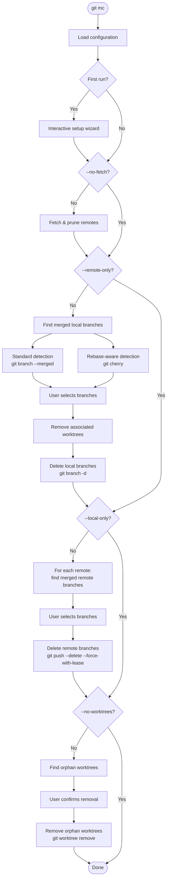

# git-merge-cleaner

Easily clean your merged branches and worktrees.

A command-line tool that detects branches merged into your main branch(es) and
offers to delete them -- both locally and on configured remotes. Also handles
orphaned worktree cleanup.

Also available as `git mc`.

## Features

- Delete local and remote branches that have been merged
- Worktree cleanup: removes worktrees for deleted branches and orphaned worktrees
- Glob pattern support for protected branches (e.g. `release/*`)
- Multiple merge detection strategies (fast merge and rebase-aware via `git cherry`)
- Interactive setup wizard on first run
- Configuration stored in git config (`[merge-cleaner]` section)
- Safety-first: `--force-with-lease` for remote deletions

## Installation

```sh
cargo install --path .
```

This installs both `git-merge-cleaner` and `git-mc` binaries, making them
available as `git merge-cleaner` and `git mc` subcommands.

## Usage

```sh
# Interactive mode (prompts for confirmation at each step)
git mc

# Auto-confirm everything
git mc --yes

# Dry run (show what would be done)
git mc --dry-run

# Show git commands being executed
git mc --verbose

# Skip fetching/pruning
git mc --no-fetch

# Only clean local or remote branches
git mc --local-only
git mc --remote-only

# Skip worktree cleanup
git mc --no-worktrees
```

### Configuration management

```sh
# Display current configuration
git mc config list

# Re-run the interactive setup wizard
git mc config setup

# Add/remove protected branch patterns
git mc config add-protected 'release/*'
git mc config remove-protected 'develop'

# Add/remove remotes to operate on
git mc config add-remote upstream
git mc config remove-remote upstream
```

## Configuration

Configuration is stored in the `[merge-cleaner]` section of your git config
(local or global):

```ini
[merge-cleaner]
    protected = main
    protected = master
    protected = release/*
    remote = origin
```

| Key | Type | Description |
|-----|------|-------------|
| `protected` | multi-value | Glob patterns for branches that should never be deleted |
| `remote` | multi-value | Remotes to delete branches from (omit for all remotes) |

### First run

On first run (when no `[merge-cleaner]` config section exists), an interactive
setup wizard runs automatically:

1. Auto-detects local branches and pre-selects well-known ones (`main`, `master`)
2. Asks for additional protected patterns (e.g. `release/*`)
3. Lists available remotes and asks which ones to operate on

## How it works

The cleanup runs in four sequential phases, each of which can be skipped via
CLI flags:

1. **Fetch & prune remotes** -- runs `git remote update --prune` on configured
   (or all) remotes to sync remote-tracking branches. Skipped with `--no-fetch`.

2. **Delete merged local branches** -- identifies branches merged into any
   protected branch using two complementary strategies:
   - *Standard detection*: `git branch --merged <target>` catches fast-forward
     and regular merges.
   - *Rebase-aware detection*: `git cherry <target> <branch>` catches
     squash-merged and rebased branches by checking whether every commit has
     already been applied upstream.

   The user selects which branches to delete. Associated worktrees are removed
   first, then branches are deleted with `git branch -d`.
   Skipped with `--remote-only`.

3. **Delete merged remote branches** -- for each configured remote, identifies
   merged remote-tracking branches with `git branch -r --merged <target>`. The
   user selects which to delete, and they are removed with
   `git push --delete --force-with-lease` for safety.
   Skipped with `--local-only`.

4. **Clean orphan worktrees** -- finds worktrees whose branch no longer exists
   locally and offers to remove them with `git worktree remove`.
   Skipped with `--no-worktrees`.



## Development

This project uses [mise](https://mise.jdx.dev/) for task management:

```sh
mise run build          # Build the project
mise run test           # Run tests with cargo-nextest
mise run lint           # Run clippy
mise run fmt            # Format code
mise run check          # Run all checks (fmt + lint + test)
mise run cover          # Generate lcov coverage report
mise run cover:html     # Generate HTML coverage report
```

## License

MIT
