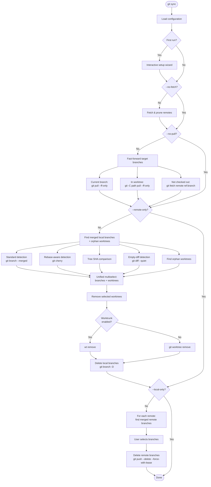

# git-sync

Easily synchronize your local branches and worktrees.

A command-line tool that detects branches merged into your main branch(es) and
offers to delete them -- both locally and on configured remotes. Also handles
orphaned worktree cleanup.

## Features

- Delete local and remote branches that have been merged
- Worktree cleanup: unified prompt for branches with worktrees and orphaned worktrees
- Respects locked worktrees: skips removal with an informational message
- Glob pattern support for protected branches (e.g. `release/*`)
- Per-branch protection via git config (`branch.<name>.sync-protected`)
- Multiple merge detection strategies (fast merge, rebase-aware via `git cherry`, tree SHA comparison, and empty-diff detection for squash merges)
- Automatic fast-forward of target branches before detection (with `--no-pull` to skip)
- Optional [worktrunk](https://worktrunk.dev) integration for worktree removal (triggers pre/post-remove hooks)
- Interactive setup wizard on first run
- Configuration stored in git config (`[sync]` section)
- Safety-first: `--force-with-lease` for remote deletions

## Installation

```sh
cargo install --path .
```

The crate is named `git-synchronizer` but installs a binary called `git-sync`,
making it available as the `git sync` subcommand.

## Usage

```sh
# Interactive mode (prompts for confirmation at each step)
git sync

# Auto-confirm everything
git sync --yes

# Dry run (show what would be done)
git sync --dry-run

# Show git commands being executed
git sync --verbose

# Skip fetching/pruning
git sync --no-fetch

# Skip pulling (fast-forwarding) target branches
git sync --no-pull

# Only clean local or remote branches
git sync --local-only
git sync --remote-only

# Skip worktree cleanup
git sync --no-worktrees

# Use worktrunk for worktree removal (triggers pre/post-remove hooks)
git sync --worktrunk

# Disable worktrunk even if configured or detected
git sync --no-worktrunk
```

### Configuration management

```sh
# Display current configuration
git sync config list

# Re-run the interactive setup wizard
git sync config setup

# Set a configuration value directly
git sync config set worktrunk false

# Add/remove protected branch patterns
git sync config add-protected 'release/*'
git sync config remove-protected 'develop'

# Protect/unprotect individual branches
git sync config protect develop
git sync config unprotect develop

# Add/remove remotes to operate on
git sync config add-remote upstream
git sync config remove-remote upstream
```

## Configuration

Configuration is stored in the `[sync]` section of your git config
(local or global):

```ini
[sync]
    protected = main
    protected = master
    protected = release/*
    remote = origin
    worktrunk = true
```

| Key | Type | Description |
|-----|------|-------------|
| `protected` | multi-value | Glob patterns for branches that should never be deleted |
| `remote` | multi-value | Remotes to delete branches from (omit for all remotes) |
| `worktrunk` | bool | Enable/disable [worktrunk](https://worktrunk.dev) for worktree removal. When omitted, auto-detects |

Individual branches can also be protected via the standard `[branch]`
config namespace:

```ini
[branch "develop"]
    sync-protected = true
```

A per-branch protected branch is excluded from deletion candidates and also
serves as a merge target (branches merged into it are flagged for cleanup).

### First run

On first run (when no `[sync]` config section exists), an interactive
setup wizard runs automatically:

1. Auto-detects local branches and pre-selects well-known ones (`main`, `master`, `develop`, `development`)
2. Asks for additional protected patterns (e.g. `release/*`)
3. Lists available remotes and asks which ones to operate on
4. If [worktrunk](https://worktrunk.dev) (`wt`) is detected on `$PATH`, asks whether to use it for worktree removal

## How it works

The cleanup runs in four sequential phases, each of which can be skipped via
CLI flags:

1. **Fetch & prune remotes** -- runs `git remote update --prune` to fetch all
   remotes and prune deleted remote-tracking branches. Skipped with `--no-fetch`.

2. **Pull / fast-forward target branches** -- fast-forwards each protected
   branch to its remote-tracking upstream so that merge detection operates on
   up-to-date refs. The strategy varies depending on the branch state:
   - *Current branch*: `git pull --ff-only` in the working directory.
   - *Checked out in another worktree*: `git pull --ff-only` run from that
     worktree directory (works with both plain git and worktrunk-managed
     worktrees).
   - *Not checked out*: `git fetch <remote> <ref>:<branch>` to update the
     local ref without any checkout.

   Branches without upstream tracking info are silently skipped. If a
   fast-forward fails (e.g. the branch has diverged), a warning is printed
   and the remaining branches are still processed.
   Skipped with `--no-pull`.

3. **Delete merged local branches & clean worktrees** -- identifies branches
   merged into any protected branch (both glob-pattern and per-branch
   protected) using several complementary strategies:
   - *Standard detection*: `git branch --merged <target>` catches fast-forward
     and regular merges.
   - *Rebase-aware detection*: `git cherry <target> <branch>` catches
     rebased branches by checking whether every commit has already been
     applied upstream.
   - *Tree SHA comparison*: compares `git rev-parse <ref>^{tree}` between
     the target and branch -- the cheapest content-equality check.
   - *Empty-diff detection*: `git diff --quiet <target> <branch>` catches
     squash-merge cases where the target tree already contains all branch
     changes.

   Per-branch protected branches also serve as merge targets, so branches
   merged into them are detected as candidates too.

   All cleanup items are presented in a **single unified multiselect**:
   merged branches (with their worktree path shown when applicable), and
   orphan worktrees (worktrees whose branch no longer exists locally).
   Merged branches default to selected; orphan worktrees default to
   unselected. The user confirms everything in one pass.

   For selected branches that have worktrees, the worktree is removed first,
   then the branch is deleted with `git branch -D` (force-delete is safe here
   because the branch is already verified as merged into a protected target).
   Selected orphan worktrees are also removed in the same pass. When
   [worktrunk](https://worktrunk.dev) is enabled (via `--worktrunk` flag,
   `sync.worktrunk` config, or auto-detection), removal is delegated to
   `wt remove` so that pre/post-remove hooks are triggered. Otherwise falls
   back to `git worktree remove`.

   Locked worktrees (via `git worktree lock`) are automatically skipped with
   an informational message -- this also prevents their branch from being
   deleted, since git refuses to delete a branch checked out in any worktree.
   Skipped with `--remote-only`. Worktree cleanup is skipped with
   `--no-worktrees`.

4. **Delete merged remote branches** -- for each configured remote, identifies
   merged remote-tracking branches with `git branch -r --merged <target>`. The
   user selects which to delete, and they are removed with
   `git push --delete --force-with-lease` for safety.
   Skipped with `--local-only`.



## Development

This project uses [mise](https://mise.jdx.dev/) for task management:

```sh
mise run build          # Build the project
mise run test           # Run tests with cargo-nextest
mise run lint           # Run clippy
mise run fmt            # Format code
mise run check          # Run all checks (fmt + lint + test)
mise run cover          # Generate lcov coverage report
mise run cover:html     # Generate HTML coverage report
mise run setup          # Install the binary locally
```

## License

MIT
