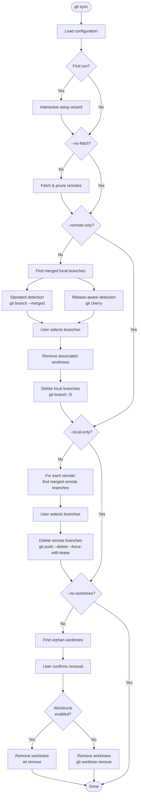

# git-sync

Easily synchronize your local branches and worktrees.

A command-line tool that detects branches merged into your main branch(es) and
offers to delete them -- both locally and on configured remotes. Also handles
orphaned worktree cleanup.

## Features

- Delete local and remote branches that have been merged
- Worktree cleanup: removes worktrees for deleted branches and orphaned worktrees
- Glob pattern support for protected branches (e.g. `release/*`)
- Per-branch protection via git config (`branch.<name>.sync-protected`)
- Multiple merge detection strategies (fast merge and rebase-aware via `git cherry`)
- Optional [worktrunk](https://worktrunk.dev) integration for worktree removal (triggers pre/post-remove hooks)
- Interactive setup wizard on first run
- Configuration stored in git config (`[sync]` section)
- Safety-first: `--force-with-lease` for remote deletions

## Installation

```sh
cargo install --path .
```

The crate is named `git-synchronizer` but installs a binary called `git-sync`,
making it available as the `git sync` subcommand.

## Usage

```sh
# Interactive mode (prompts for confirmation at each step)
git sync

# Auto-confirm everything
git sync --yes

# Dry run (show what would be done)
git sync --dry-run

# Show git commands being executed
git sync --verbose

# Skip fetching/pruning
git sync --no-fetch

# Only clean local or remote branches
git sync --local-only
git sync --remote-only

# Skip worktree cleanup
git sync --no-worktrees

# Use worktrunk for worktree removal (triggers pre/post-remove hooks)
git sync --worktrunk

# Disable worktrunk even if configured or detected
git sync --no-worktrunk
```

### Configuration management

```sh
# Display current configuration
git sync config list

# Re-run the interactive setup wizard
git sync config setup

# Add/remove protected branch patterns
git sync config add-protected 'release/*'
git sync config remove-protected 'develop'

# Protect/unprotect individual branches
git sync config protect develop
git sync config unprotect develop

# Add/remove remotes to operate on
git sync config add-remote upstream
git sync config remove-remote upstream
```

## Configuration

Configuration is stored in the `[sync]` section of your git config
(local or global):

```ini
[sync]
    protected = main
    protected = master
    protected = release/*
    remote = origin
    worktrunk = true
```

| Key | Type | Description |
|-----|------|-------------|
| `protected` | multi-value | Glob patterns for branches that should never be deleted |
| `remote` | multi-value | Remotes to delete branches from (omit for all remotes) |
| `worktrunk` | bool | Enable/disable [worktrunk](https://worktrunk.dev) for worktree removal. When omitted, auto-detects |

Individual branches can also be protected via the standard `[branch]`
config namespace:

```ini
[branch "develop"]
    sync-protected = true
```

A per-branch protected branch is excluded from deletion candidates and also
serves as a merge target (branches merged into it are flagged for cleanup).

### First run

On first run (when no `[sync]` config section exists), an interactive
setup wizard runs automatically:

1. Auto-detects local branches and pre-selects well-known ones (`main`, `master`)
2. Asks for additional protected patterns (e.g. `release/*`)
3. Lists available remotes and asks which ones to operate on
4. If [worktrunk](https://worktrunk.dev) (`wt`) is detected on `$PATH`, asks whether to use it for worktree removal

## How it works

The cleanup runs in four sequential phases, each of which can be skipped via
CLI flags:

1. **Fetch & prune remotes** -- runs `git remote update --prune` on configured
   (or all) remotes to sync remote-tracking branches. Skipped with `--no-fetch`.

2. **Delete merged local branches** -- identifies branches merged into any
   protected branch (both glob-pattern and per-branch protected) using two
   complementary strategies:
   - *Standard detection*: `git branch --merged <target>` catches fast-forward
     and regular merges.
   - *Rebase-aware detection*: `git cherry <target> <branch>` catches
     squash-merged and rebased branches by checking whether every commit has
     already been applied upstream.

   Per-branch protected branches also serve as merge targets, so branches
   merged into them are detected as candidates too. The user selects which
   branches to delete. Associated worktrees are removed first, then branches
   are deleted with `git branch -D` (force-delete is safe here because the
   branch is already verified as merged into a protected target).
   Skipped with `--remote-only`.

3. **Delete merged remote branches** -- for each configured remote, identifies
   merged remote-tracking branches with `git branch -r --merged <target>`. The
   user selects which to delete, and they are removed with
   `git push --delete --force-with-lease` for safety.
   Skipped with `--local-only`.

4. **Clean orphan worktrees** -- finds worktrees whose branch no longer exists
   locally and offers to remove them. When
   [worktrunk](https://worktrunk.dev) is enabled (via `--worktrunk` flag,
   `sync.worktrunk` config, or auto-detection), removal is delegated to
   `wt remove` so that pre/post-remove hooks are triggered. Otherwise falls
   back to `git worktree remove`.
   Skipped with `--no-worktrees`.



## Development

This project uses [mise](https://mise.jdx.dev/) for task management:

```sh
mise run build          # Build the project
mise run test           # Run tests with cargo-nextest
mise run lint           # Run clippy
mise run fmt            # Format code
mise run check          # Run all checks (fmt + lint + test)
mise run cover          # Generate lcov coverage report
mise run cover:html     # Generate HTML coverage report
mise run setup          # Install the binary locally
```

## License

MIT
