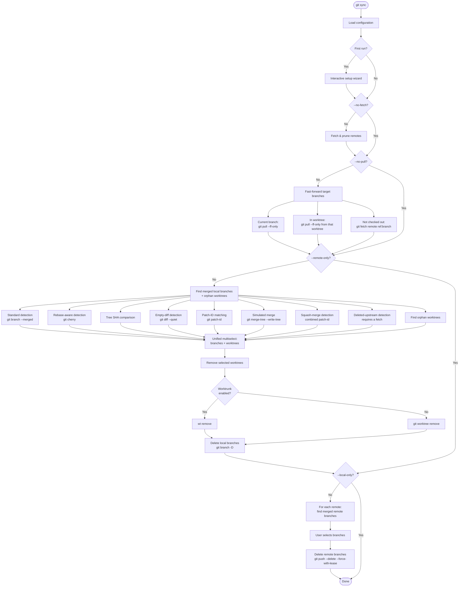

<p align="center">
  
</p>

<p align="center"><strong>Easily synchronize your local branches and worktrees</strong></p>

<p align="center">
  <a href="https://github.com/noirbizarre/git-synchronizer/actions/workflows/ci.yml">
    
  </a>
  <a href="https://codecov.io/gh/noirbizarre/git-synchronizer">
    
  </a>
  <a href="https://crates.io/crates/git-synchronizer">
    
  </a>
  
  
</p>

---

# git-synchronizer (git-sync)

`git-synchronizer` provides the `git sync` command: it detects branches merged
into your main branch(es) and offers to delete them -- both locally and on
configured remotes. It also handles orphaned worktree cleanup.

## Features

- Delete local and remote branches that have been merged
- Worktree cleanup: unified prompt for branches with worktrees and orphaned worktrees
- Respects locked worktrees: skips removal with an informational message
- Glob pattern support for protected branches (e.g. `release/*`)
- Per-branch protection via git config (`branch.<name>.sync-protected`)
- Ignore branch patterns entirely (`sync.ignore`) -- never fetched, never analysed
- Multiple merge detection strategies (fast merge, rebase-aware via `git cherry`, tree SHA comparison, empty three-dot diff, patch-ID matching, simulated merge, squash-merge detection, and deleted-upstream detection)
- Automatic fast-forward of target branches before detection (with `--no-pull` to skip)
- Optional [worktrunk](https://worktrunk.dev) integration for worktree removal (triggers pre/post-remove hooks)
- Interactive setup wizard on first run
- Configuration stored in git config (`[sync]` section)
- Safety-first: `--force-with-lease` for remote deletions

## Installation

From crates.io:

```sh
cargo install git-synchronizer
```

Or grab a prebuilt binary for your platform from the
[latest release](https://github.com/noirbizarre/git-synchronizer/releases/latest).

From a checkout:

```sh
cargo install --path .
```

The crate is named `git-synchronizer` but installs a binary called `git-sync`,
making it available as the `git sync` subcommand.

## Usage

```sh
# Interactive mode (prompts for confirmation at each step)
git sync

# Auto-confirm everything
git sync --yes

# Dry run (show what would be done)
git sync --dry-run

# Show git commands being executed
git sync --verbose

# Skip fetching/pruning
git sync --no-fetch

# Skip pulling (fast-forwarding) target branches
git sync --no-pull

# Only clean local or remote branches
git sync --local-only
git sync --remote-only

# Skip worktree cleanup
git sync --no-worktrees

# With -y, also delete branches whose upstream branch was deleted
git sync -y --delete-gone

# Use worktrunk for worktree removal (triggers pre/post-remove hooks)
git sync --worktrunk

# Disable worktrunk even if configured or detected
git sync --no-worktrunk
```

### Configuration management

```sh
# Display current configuration
git sync config list

# Re-run the interactive setup wizard
git sync config setup

# Set a configuration value directly
git sync config set worktrunk false

# Add/remove protected branch patterns
git sync config add-protected 'release/*'
git sync config remove-protected 'develop'

# Protect/unprotect individual branches
git sync config protect develop
git sync config unprotect develop

# Add/remove ignored branch patterns
git sync config add-ignore 'wip/*'
git sync config remove-ignore 'wip/*'

# Ignore/unignore individual branches
git sync config ignore experiment
git sync config unignore experiment

# Add/remove remotes to operate on
git sync config add-remote upstream
git sync config remove-remote upstream
```

## Configuration

Configuration is read from the `[sync]` section of your git config at any
scope (local, global or system). Every `git sync config` subcommand **writes**
to the repository-local `.git/config`:

```ini
[sync]
    protected = main
    protected = master
    protected = release/*
    ignore = wip/*
    remote = origin
    worktrunk = true
```

| Key | Type | Description |
|-----|------|-------------|
| `protected` | multi-value | Glob patterns for branches that should never be deleted |
| `ignore` | multi-value | Glob patterns for branches git-sync ignores entirely |
| `remote` | multi-value | Remotes to delete branches from (omit for all remotes) |
| `worktrunk` | bool | Enable/disable [worktrunk](https://worktrunk.dev) for worktree removal. When omitted, auto-detects (see below) |

When `worktrunk` is unset, git-sync enables it only if the repository has a
`[worktrunk]` config section **and** `wt` is on `$PATH`; it then asks once per
run before using it, and enables it without asking under `--yes`. If either
condition is missing, worktrunk is not used.

Individual branches can also be protected via the standard `[branch]`
config namespace:

```ini
[branch "develop"]
    sync-protected = true
```

A per-branch protected branch is excluded from deletion candidates and also
serves as a merge target (branches merged into it are flagged for cleanup).

### Ignored branches

Ignored branches are invisible to git-sync: they are never fetched, never
become merge targets, never appear as deletion candidates, and their worktrees
are left alone. Use them for branches git-sync has no business touching, such
as long-lived spikes or vendor branches.

Patterns go in `sync.ignore`, and individual branches can carry the flag
directly:

```ini
[branch "experiment"]
    sync-ignored = true
```

**Ignoring takes precedence over protection.** A branch matching both
`sync.protected` and `sync.ignore` is ignored, which also means it is *not*
used as a merge target.

Exclusion at fetch time is implemented with negative refspecs
(`^refs/heads/wip/*`), which require **git 2.29 or later** and understand a
single `*` wildcard only. Richer glob patterns (`?`, character classes,
alternates) are still fetched, then filtered out by the same matcher used
everywhere else. Note that when at least one ignore pattern is expressible as a
refspec (a single `*` and no other metacharacters), the fetch uses an explicit
refspec and therefore bypasses a custom `remote.<name>.fetch` setting. With only
richer patterns, the default fetch — and your custom refspec — is left intact.

### First run

On first run (when no `[sync]` config section exists), an interactive
setup wizard runs automatically:

1. Auto-detects local branches and pre-selects well-known ones (`main`, `master`, `develop`, `development`)
2. Asks for additional protected patterns (e.g. `release/*`)
3. Asks for branch patterns to ignore entirely (e.g. `wip/*`)
4. Lists available remotes and asks which ones to operate on
5. If [worktrunk](https://worktrunk.dev) (`wt`) is detected on `$PATH`, asks whether to use it for worktree removal

## How it works

The cleanup runs in four sequential phases, each of which can be skipped via
CLI flags:

1. **Fetch & prune remotes** -- runs `git fetch --prune <remote>` for each
   configured remote (every remote when `sync.remote` is unset), pruning
   deleted remote-tracking branches. Skipped with `--no-fetch`.

2. **Pull / fast-forward target branches** -- fast-forwards each protected
   branch to its remote-tracking upstream so that merge detection operates on
   up-to-date refs. The strategy varies depending on the branch state:
   - *Current branch*: `git pull --ff-only` in the working directory.
   - *Checked out in another worktree*: `git pull --ff-only` run from that
     worktree directory (works with both plain git and worktrunk-managed
     worktrees).
   - *Not checked out*: `git fetch <remote> <ref>:<branch>` to update the
     local ref without any checkout.

   Branches without upstream tracking info are silently skipped. If a
   fast-forward fails (e.g. the branch has diverged), a warning is printed
   and the remaining branches are still processed.
   Skipped with `--no-pull`.

3. **Delete merged local branches & clean worktrees** -- identifies branches
   merged into any protected branch (both glob-pattern and per-branch
   protected) using several complementary strategies, applied from cheapest to
   most expensive and stopping as soon as one matches:
   - *Standard detection*: `git branch --merged <target>` catches fast-forward
     and regular merges.
   - *Rebase-aware detection*: `git cherry <target> <branch>` catches
     rebased branches by checking whether every commit has already been
     applied upstream.
   - *Tree SHA comparison*: compares `git rev-parse <ref>^{tree}` between
     the target and branch -- the cheapest content-equality check.
   - *Empty three-dot diff*: `git diff --quiet <target>...<branch>` catches
     branches whose own commits net out to no content change relative to their
     fork point (a commit and its revert, a pure history rewrite, a branch
     created but never meaningfully advanced).
   - *Patch-ID matching*: compares `git patch-id --stable` fingerprints of the
     branch's commits against those recently applied on the target, catching
     branches re-applied under different SHAs (rebase + reword, partial
     cherry-pick, history rewrite).
   - *Simulated merge*: `git merge-tree --write-tree <target> <branch>` --
     if merging the branch would produce exactly the target's current tree,
     the branch adds nothing. Handles squash merges even after the target has
     advanced with unrelated changes.
   - *Squash-merge detection*: compares the patch-ID of the branch's combined
     diff against the target's recent commits, catching multi-commit branches
     collapsed into a single squash commit.

   Per-branch protected branches also serve as merge targets, so branches
   merged into them are detected as candidates too.

   In addition, branches whose **upstream tracking branch no longer exists**
   are reported as a separate category. This is the footprint left by a merged
   pull request whose remote branch was deleted, and it is often the only
   remaining signal for branches squash-merged into a target that has since
   advanced far enough for the content-based strategies above to lose the
   trail. Because a deleted upstream does *not* prove the branch was merged
   (someone may simply have deleted an unmerged remote branch), these entries
   are **listed unchecked** in the multiselect and are never auto-selected by
   `--yes` unless you also pass `--delete-gone`. Detection requires up-to-date
   remote-tracking refs, so it only runs after a successful `fetch --prune`,
   or in `--dry-run` where a warning notes the results may be stale.

   All cleanup items are presented in a **single unified multiselect**:
   merged branches (with their worktree path shown when applicable), branches
   with a deleted upstream, and orphan worktrees (worktrees whose branch no
   longer exists locally). Merged branches default to selected;
   deleted-upstream branches and orphan worktrees default to unselected.

   Two cases are handled outside that multiselect. Worktrees that are dirty
   (uncommitted or untracked changes) or hold unmerged commits are collected
   into a **second multiselect** for forced removal, defaulting to unselected;
   anything left unselected there is skipped entirely, with neither the
   worktree removed nor the branch deleted. Under `--yes` all of them are
   force-removed without prompting. Separately, a selected branch whose
   commits are unreachable from any merge target is force-deleted
   automatically, with an informational line rather than a prompt.

   For selected branches that have worktrees, the worktree is removed first,
   then the branch is deleted with `git branch -D` (force-delete is safe here
   because the branch is already verified as merged into a protected target).
   Selected orphan worktrees are also removed in the same pass. When
   [worktrunk](https://worktrunk.dev) is enabled (via `--worktrunk` flag,
   `sync.worktrunk` config, or auto-detection), removal is delegated to
   `wt remove` so that pre/post-remove hooks are triggered. Otherwise falls
   back to `git worktree remove`.

   Locked worktrees (via `git worktree lock`) are automatically skipped with
   an informational message -- this also prevents their branch from being
   deleted, since git refuses to delete a branch checked out in any worktree.
   Skipped with `--remote-only`. Worktree cleanup is skipped with
   `--no-worktrees`.

4. **Delete merged remote branches** -- for each configured remote, identifies
   merged remote-tracking branches with `git branch -r --merged <target>`. The
   user selects which to delete, and they are removed with
   `git push --delete --force-with-lease` for safety.

   Note that remote detection currently uses **only** this standard ancestor
   check: the cherry, tree, patch-ID and simulated-merge strategies listed in
   step 3 are applied to local branches only. Remote branches that were
   squash- or rebase-merged are therefore not reported yet -- see
   [issue #28](https://github.com/noirbizarre/git-synchronizer/issues/28).
   Their local counterparts are still detected normally.
   Skipped with `--local-only`.


```mermaid
flowchart TD
    Start([git sync]) --> LoadConfig[Load configuration]
    LoadConfig --> FirstRun{First run?}
    FirstRun -- Yes --> Setup[Interactive setup wizard]
    Setup --> FetchCheck
    FirstRun -- No --> FetchCheck

    FetchCheck{--no-fetch?}
    FetchCheck -- No --> Fetch[Fetch & prune remotes]
    Fetch --> PullCheck
    FetchCheck -- Yes --> PullCheck

    PullCheck{--no-pull?}
    PullCheck -- No --> Pull[Fast-forward target branches]
    Pull --> PullCurrent[Current branch:\ngit pull --ff-only]
    Pull --> PullWT[In worktree:\ngit pull --ff-only from that worktree]
    Pull --> PullFetch[Not checked out:\ngit fetch remote ref:branch]
    PullCurrent --> LocalCheck
    PullWT --> LocalCheck
    PullFetch --> LocalCheck
    PullCheck -- Yes --> LocalCheck

    LocalCheck{--remote-only?}
    LocalCheck -- No --> FindLocal[Find merged local branches\n+ orphan worktrees]
    FindLocal --> Merged[Standard detection\ngit branch --merged]
    FindLocal --> Cherry[Rebase-aware detection\ngit cherry]
    FindLocal --> TreeSHA[Tree SHA comparison]
    FindLocal --> EmptyDiff[Empty-diff detection\ngit diff --quiet]
    FindLocal --> PatchID[Patch-ID matching\ngit patch-id]
    FindLocal --> SimMerge[Simulated merge\ngit merge-tree --write-tree]
    FindLocal --> Squash[Squash-merge detection\ncombined patch-id]
    FindLocal --> GoneUpstream[Deleted-upstream detection\nrequires a fetch]
    FindLocal --> Orphans[Find orphan worktrees]
    Merged --> SelectLocal[Unified multiselect:\nbranches + worktrees]
    Cherry --> SelectLocal
    TreeSHA --> SelectLocal
    EmptyDiff --> SelectLocal
    PatchID --> SelectLocal
    SimMerge --> SelectLocal
    Squash --> SelectLocal
    GoneUpstream --> SelectLocal
    Orphans --> SelectLocal
    SelectLocal --> RemoveWT[Remove selected worktrees]
    RemoveWT --> UseWT{Worktrunk\nenabled?}
    UseWT -- Yes --> WTRemove[wt remove]
    UseWT -- No --> GitWTRemove[git worktree remove]
    WTRemove --> DeleteLocal[Delete local branches\ngit branch -D]
    GitWTRemove --> DeleteLocal
    DeleteLocal --> RemoteCheck
    LocalCheck -- Yes --> RemoteCheck

    RemoteCheck{--local-only?}
    RemoteCheck -- No --> FindRemote[For each remote:\nfind merged remote branches]
    FindRemote --> SelectRemote[User selects branches]
    SelectRemote --> DeleteRemote[Delete remote branches\ngit push --delete --force-with-lease]
    DeleteRemote --> Done
    RemoteCheck -- Yes --> Done

    Done([Done])
```

## Development

This project uses [mise](https://mise.jdx.dev/) for task management. Start by
installing the toolchain and the git hooks:

```sh
mise install            # Install the pinned toolchain and tools
prek install            # Install the pre-commit and commit-msg git hooks
```

The hooks are what enforce formatting, clippy and the commit convention
locally; without them the first feedback comes from CI.

```sh
mise run build          # Build the project
mise run build:release  # Build in release mode
mise run test           # Run tests with cargo-nextest
mise run lint           # Run clippy
mise run lint:actions   # Lint the GitHub Actions workflows
mise run fmt            # Format code
mise run fmt-check      # Check formatting without rewriting files
mise run check          # Run all checks (fmt-check + lint + test)
mise run cover          # Generate lcov coverage report
mise run cover:html     # Generate HTML coverage report
mise run changelog      # Preview the next version and changelog
mise run ship:validate  # Validate the gh-ship release setup
mise run setup          # Install the binary locally
```

### Commits

[Conventional Commits](https://www.conventionalcommits.org/), enforced by
commitlint via the prek `commit-msg` hook and re-checked by the CI lint job.
The changelog and the next version number are derived from them, so the type
and scope matter.

### Releases

Orchestrated by [gh-ship](https://github.com/noirbizarre/gh-ship), with the
version and the changelog produced by [git-cliff](https://git-cliff.org)
(`cliff.toml`). gh-ship never versions and never writes changelogs; it drives
the lifecycle:

1. push to `main` → `gh ship prepare` opens or updates the **Release PR** on
   the `release/next` branch, carrying the `Cargo.toml` bump and the changelog;
2. review the changelog and merge that PR;
3. `gh ship release` tags the merge commit as `vX.Y.Z`, drafts the release,
   attaches the cross-compiled binaries, publishes the crate to crates.io, and
   only then makes the release public.

Maintainers do not tag by hand. `gh ship validate` runs in CI, so a workflow
that stops satisfying the contract fails on a pull request rather than
mid-release.

## License

MIT
